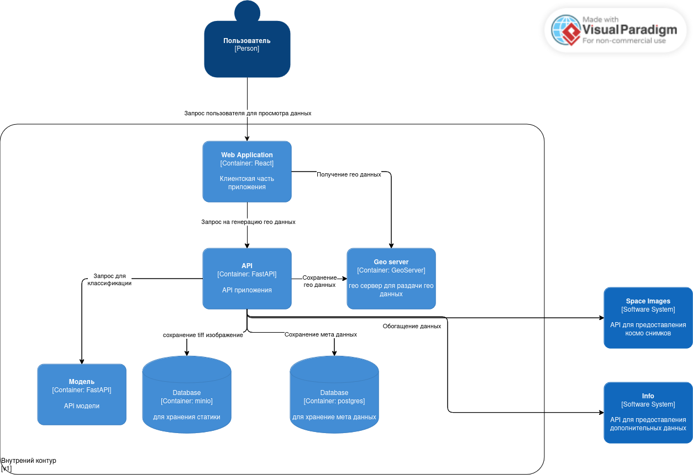

### Пайплайн

### Архитектура продового решения

### ML:
- инференс находиться [тут](ml/notebooks/inference.ipynb)
- обучение находиться [тут](ml/notebooks/boost.ipynb)

### Как запускать:
- скопировать `.docker/.env.example` в `.docker/.env` и заполнить информацией
- скопировать `config/.env.example` в `config/.env` и заполнить информацией
- Если нет SSL сертификатов, то закомментировать в docker-compose nginx сервис и открыть порт 8000 в app
- сделать `docker compose up --build`